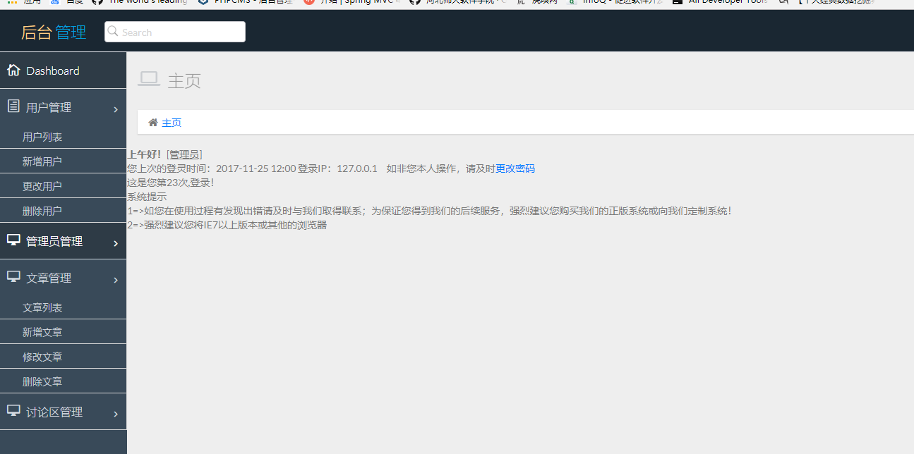
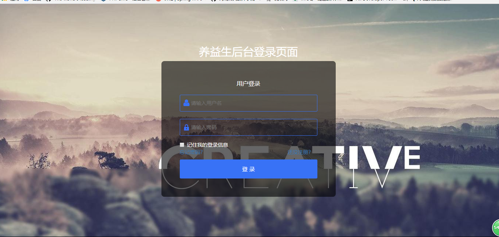
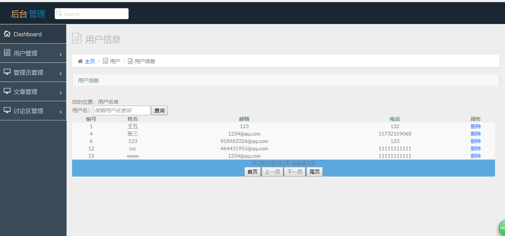
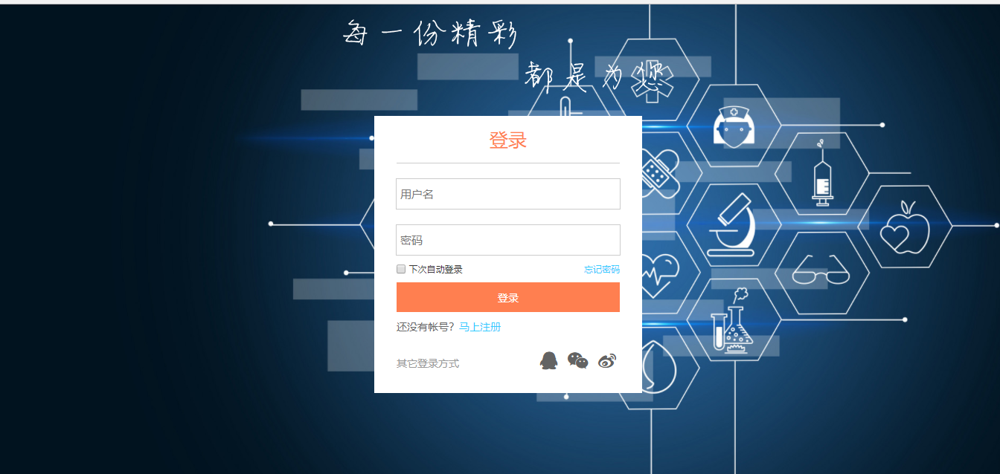
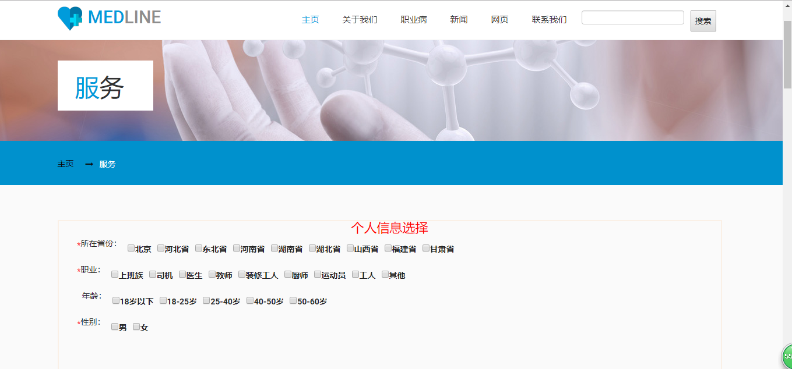
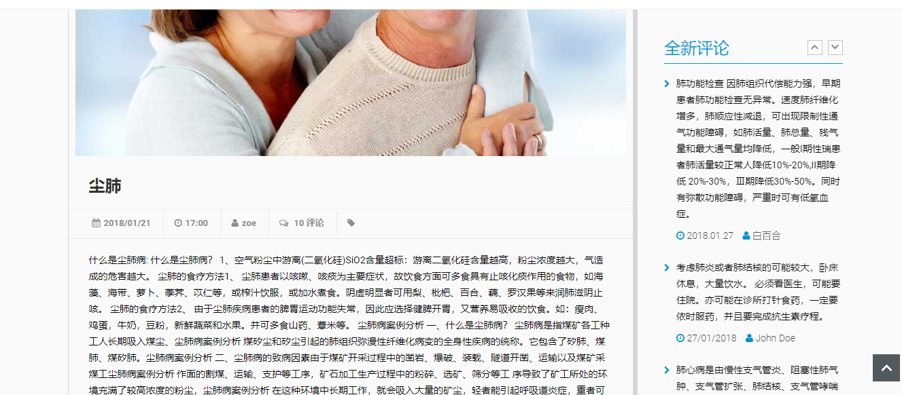

#养益生
* [Github](https://github.com/Wangfengduo/JavaProject) 

### 项目简介

**养益生**是一个包含了职业病病因及保健康复治疗信息，病情详细查询、用户心得评论交流功能的网站

        现代人的职业病凸显越来越严重，我们致力于打造一个针对在工作中因为自己职业原因遇到的健康问题，大家还可以在评论区说明自己的问题或见解。同时，网站还会找出典型性的病人经历和大家分享，给大家以借鉴和参考。

### 项目成员
* 曹冰倩(项目经理)
  * Email: <464431955@qq.com>
  * Github : [https://github.com/caobingqian](https://github.com/caobingqian)
* 王凤铎 (开发工程师) 
  * Email: <958963326@qq.com>
  * Github : [https://github.com/Wangfengduo](https://github.com/Wangfengduo)
* 王莹莹(UI设计、开发工程师)
  * Email: <1204310814@qq.com>
  * Github : [https://github.com/wangyingying-6](https://github.com/wangyingying-6)
* 祝贝贝(UI设计、产品经理)
  * Email: <845431735@qq.com>
  * Github : [https://github.com/zhubeibei6](https://github.com/zhubeibei6)
* 程雨晨(UI设计、开发工程师)
  * Email: <1037036384@qq.com>
  * Github : [https://github.com/chengyuchn](https://github.com/chengyuchn)
* 张帅(开发工程师)
  * Email: <421651638@qq.com>
  * Github : [https://github.com/zhngshuai](https://github.com/zhngshuai)
* 俞佳越(测试工程师)
  * Email: <913411227@qq.com>
  * Github : [https://github.com/yujiayue](https://github.com/yujiayue)

### 运行效果

